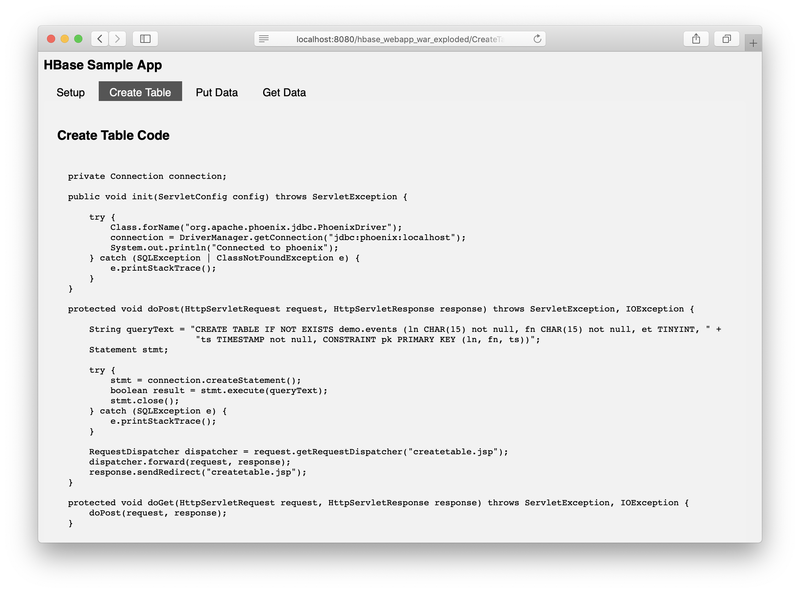

# hbase-phoenix-examples

This project is a java webapp that demonstrates the following:
- How to configure HBase and Phoenix
- How to create a connection to Phoenix in Java
- How to create a table in HBase via Phoenix in Java
- How to upsert data into an HBase table via Phoenix in Java
- How to query data in HBase via Phoenix in Java

The webapp is simple. It contains a menu item for each operation listed above. When you click the menu item, the webapp actually
performs the operation and in response, the actual code that you need to implement the operation is printed to the screen.

<figure class="video_container">
  <video width="320" height="240" controls>
    <source src="video/sample.mp4" type="video/mp4">
  </video>
</figure>
